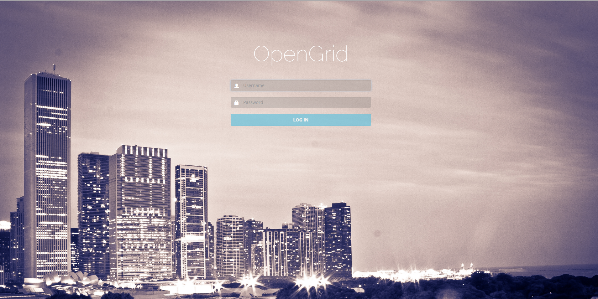
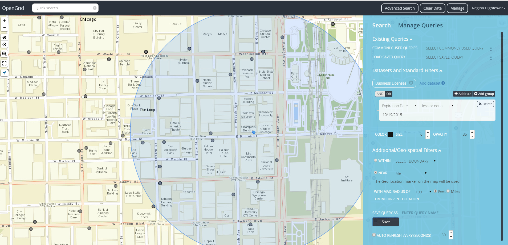
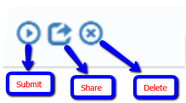
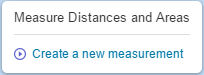
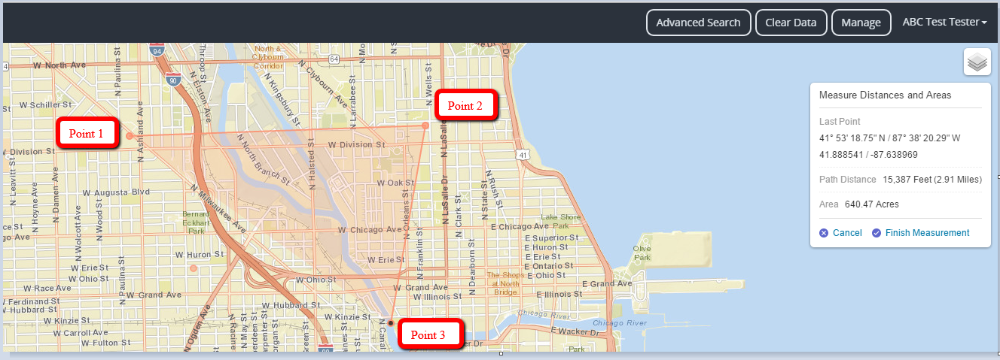
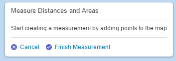
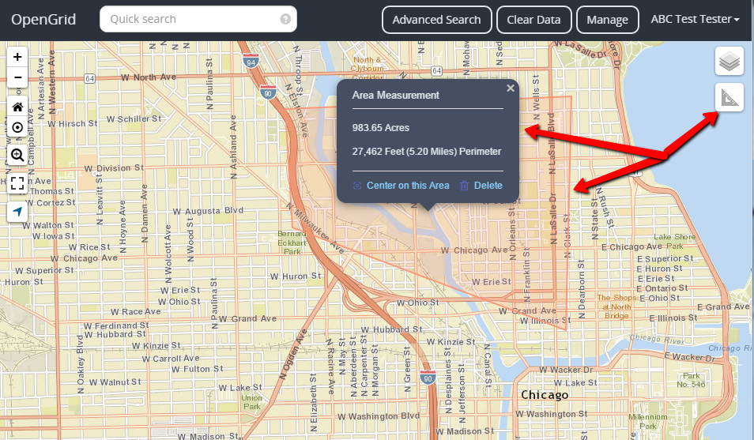

 

## Getting Started

OpenGrid is an enterprise geographical information system. Developed to support situational awareness, incident monitoring and responses, historical data retrieval, and real-time advanced analytics.

The OpenGrid architecture consists of three primary parts: the user interface, service layer, and data layer. The user interface is design to remain unchanged. The service layer is meant to be flexible to any data source. The data layer will be implemented based on client specifications.

OpenGrid utilizes MongoDB, a NoSQL database optimized to handle big spatially-enabled data. From the application layer, users may then query data by type, time and distance from a point or within a boundary, while retrieving real-time or historical data. Queries and data flow through a web service to ensure data security.

### Acknowledgements
OpenGrid was developed with the support of Bloomberg Philanthropies. 

## User Documentation

User documentation is designed to assist end users with the use of OpenGrid product and services. Upon usage of documentation the user will gain appropriate knowledge and capabilities to navigate the system. The user will inherit an understanding of the system and its processes and have the foundation to execute queries for navigation.

 
#### Supported Browsers

OpenGrid supports both mobile and desktop versions search engines. Mobile Android devices support Firefox version 40&#43; and Chrome 44&#43;. Ios devices support Chrome 45&#43;, Safari 8.1&#43; and Firefox 40&#43;. Desktop versions support Firefox 42&#43; and Chrome 46&#43;; Internet Explorer is supported from IE10&#43; no older versions will be continued. All browsers must have cookies enabled and support JavaScript/ECMAScript version 5.1.

## Quick Search

The quick search help feature assist users in performing a valid search. Each search is unique based on query type. Some are queried by keyword and others are queried based off keyword followed by key phrase (descriptive text) e.g., tweets and weather query. The search results will appear on the grid as either points or custom icons.

<b>Find an Address</b>  50 W. Washington St

<b>Display area by Lat and Long</b>  41.8270, -87.6423

<b>Search by Place Name</b>  Daley Center

<b>Search by Tweets</b>  Tweet Ballet

<b>Search area weather</b>  Weather 60602

## Advanced Search

Advanced Search allows you to combine search terms by setting specific parameters for your results.It gives the user the ability to narrow their searches by a series of different filters such as adding additional rules, groups,datasets and Geo spatial-filters.

### Selecting data and date range

To query by data and date range...Click on add datasets, select the saved dataset from the list <b>(for ex: business license)</b>; click submit. Add a rule or group to your dataset <b><small>(Adding a rule or group gives the user an option to query by date, city, name, address, etc. depending on the search criteria.)</b></small>. Date range can be specified with the parameters of:

- equal
- not equal 
- less
- less or equal
- greater 
- greater or equal
- between
 

### Search around a parameter (Point)

To search with given point or boundaries the Geo spatial-filters will have to be applied. 
There are two filters to search by <b>“Within”</b> and <b>“Near”</b>. <b>“Within”</b> is used to search boundaries within a query. <b>“Near”</b> is used to search within a given parameter or around the area of your locale.

<b><i>Within</i></b> have search boundaries of: 

- Map Extent 
- Drawn Extent (create polygon or rectangular perimeter) 
- Citywide (within the city limits) 
- Zip Code (within a given zip code) 
- Ward (within a given ward)

<b><i>Near</i></b> have search points of:

- Near <b>“Me”</b> (search around the user geo location) 
- Near <b>“Marker”</b> (search around a given area)

## Monitoring Queries

The monitor mode in the quick search section allows the user to monitor and update activity using auto-refresh. To use auto-refresh for monitoring queries:

<ul>
<li>Enable the auto-refresh check-box</li>
<li>Ascend or descend on the seconds needed for refreshing the screen <b><i><small>(seconds are user preference)</b></i></small>.
</li>
</ul>

## Table Functions

The table functionality is used to organized information that has been displayed via query. The table displays the data that was pulled from the queried results and in return structures it in a readable format for the user to interpret. Each dropdown are intertwined with one another.The table consist of five drop down sections: 

#### 1. Columns 
The columns section displays the list of columns from the query data-sets and places them in order by default. The columns can be interchangeable and removed to fit the user preference.

#### 2. Exportation 
The exportation dropdown is used to send or transmit data from the query into csv, pdf or MS- excel format. 

#### 3. Graphing 
The graphing functionality is used to display the query results into graph formation based on the information. The user has the decision to create a graph based key search criteria’s that displays in the dropdown list.

#### 4. Heat Map 
Heat Map function is displayed where values contained in a matrix are represented as colors. There are many color schemes that can be used to illustrate a heat map.

#### 5. Tile Map
Tile Maps are small images, usually rectangular or isometric that acts like a puzzle piece to cover an intended area.

### Manage Saved Queries

Search criteria that’s been entered and saved within the database are called Saved Queries. The saved queries are store in the Manage Queries section. To save a query, the user enters in the preferred name for a query; then clicks the saved button. The user will also be given an option to overwrite other queries and save it using an existing name.

There are three icons for managing queries submit, share and delete. The submit function allows the user to run the query for the manage queries window. The share function gives the user the ability to share a query either to a group or to another user. The delete function gives the user the option to delete a query.

 

## Measure Distance and Area

Measuring distances and areas is a function within OpenGrid that allows the user to perform measurements between any given point to another. Once the measurement tool is selected the user will be prompt to start creating measurements by adding points on the map.

## Measurement and Tools

Click the measurement tool icon.
  
 

A measurement tool textbox will appear with an option to <b>create a new measurement</b>.

 

Once click <b>"create a new measurement"</b>... display points of origin and destination on the map by creating points.
 
 

 

After the measurement has been created the finish measurement textbox will appear. click <b>"Finish Measurement"</b>.

 

After clicking on finish measurement the <b>"Area Measurement"</b> textbox will appear providing information about the perimeter:
.
<ul>
<li>Acres</li>
<li>Feet</li>
<li>Miles</li>
</ul>

It also gives the user an option to center on the Area or to Delete the perimeter.

 

## FREQUENTLY ASKED QUESTIONS

#### Whats the difference between quick search and advanced search

 Quick search is a simple search tool that is queried with specific parameters but may return a broader result set whereas Advanced Search is used to combine search terms by setting specific parameters for result set; "Advanced Search" enables a user to search for requirements, features or use cases that match specific values in a dataset. The search results are smaller and more relevant than results from a quick search.

#### Whats the difference between Near Me and Near Marker

The Near <b>"Me"</b> and the Near <b>"Marker"</b> both use triangulation techniques. It’s located within the Advanced Search section under the geo-spatial filter.  Using the Near <b>“Me”</b> function will retrieve the perimeter around the user location using both lat and long to triangulate the user’s location or from usage of information from cell towers to pinpoint the approximate position. Near <b>“Marker”</b> function will pull data around the perimeter based off a given point using markers.

 

<a href="#top">Back to Top</a>

