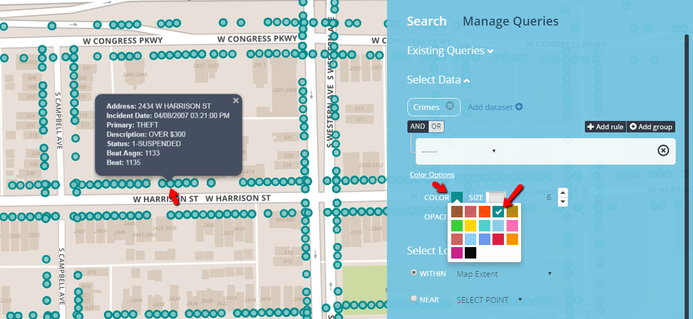

# Color Options

Color Options is a collapsible link; where data points appearances are manipulated. The color option is only visible when a search is created. Each dataset has a default color theme, but in some circumstances a user may need to change the color option of a data point. 

# Customizing the color of the dots

By default, each dataset is tied to a particular color, but can be adjusted. Change the color of a data point for a dataset by selecting the "Color" option. There is a pre-loaded palette of colors that you may select. 

<b>default color option screen when size slider is not fill places data points on the map</b>

<b>options color pallet and how it correlates to data points on the grid</b>

# Changing the size of all dots

- The size has a slider feature as an icon that switches between two features.
	- Increase/decrease the size in data points.
	- Changes the data from standard points on a grid to bubble plotting.

## Change transparency of the dots

You can adjust how transparent each dot appears on the map. By default, the color has an opacity of 85 percent, but can be changed by adjusting the opacity level. This can be especially helpful when there are many dots on the map that crowd your ability to view all of the data.
