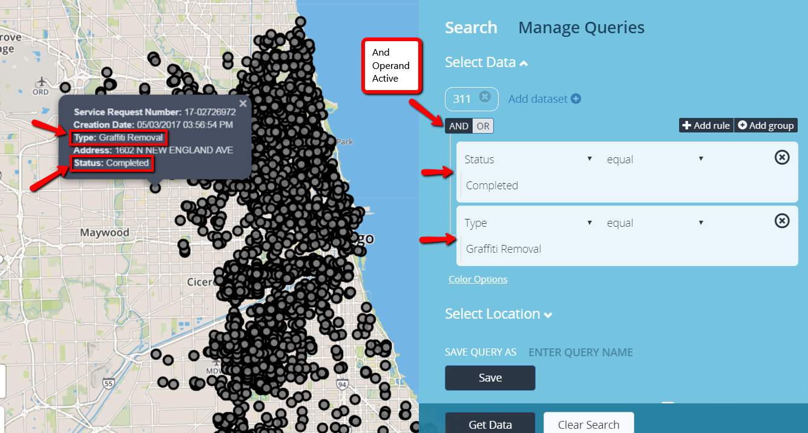

# Advanced Filtering

Filtering is a useful way to view data you want displayed. There are mulitple ways to filter data. A user can query on mulitple conditions using AND/OR operator. The AND operand, returns values when all conditions are true. The OR operand, returns values when one or more conditions are true.

<b>Operator Connector</b>

## Match all conditions

<b>"AND" Operand</b>

## Match any condition

<b>"OR" Operand</b>

## Grouping Filters

<b>Add Group</b>

