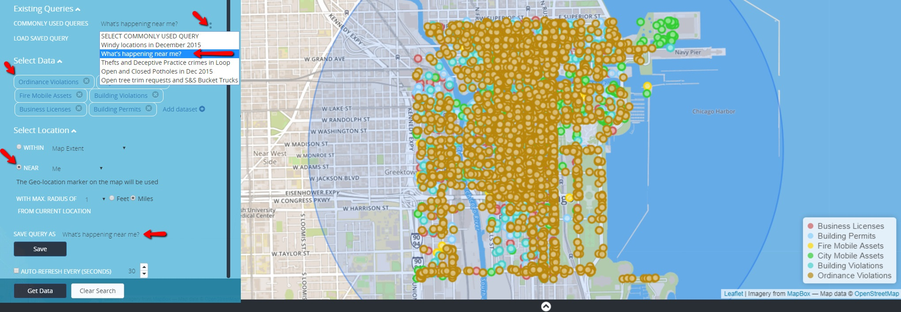

Commonly Used Queries are predefined executeable searches. Each search has preselected parameters that has been defined. Users can view the
predefined parameters within the Select Data and/or Select Location section of the find data panel. Users can also build upon a predefined
query and personalize it to their preference. 

To execute a Commonly Used Queries, in the find data panel under Existing Queries-> select <b>
"COMMONLY USED QUERIES"</b> droplist and select a predefined query. Click Get Data. The example below
displays the query <b>"What's happening near me?"</b> from the list.

<b>Commonly Used Queries</b>
