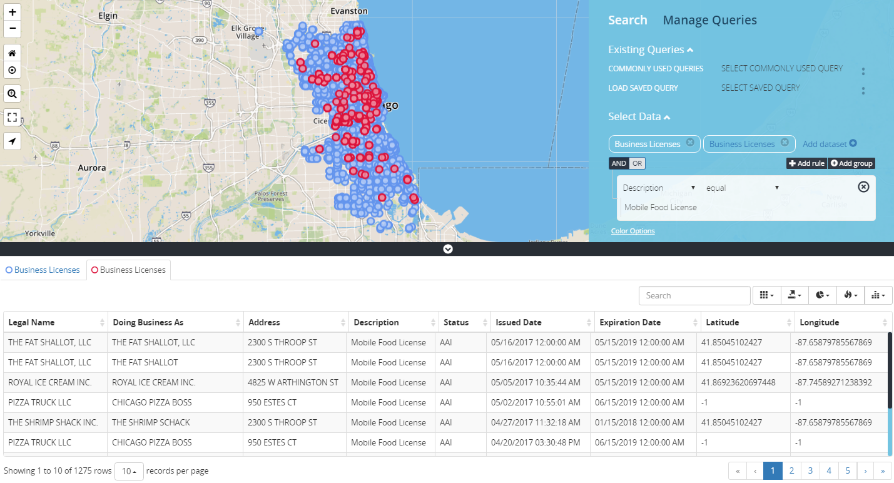

# Getting Started

1. In Select Data – Select the Add Dataset Link.

2. A drop list of available datasets appears, select the appropriate Dataset.

3. Parameter box appears with and/or operator as connectors.

4. Identify the parameters from the drop list.

5. Add location boundary (see "_Select Location_" section), if needed.

6. Execute the search, select "Get Data".

## Search Examples

### Single Search With No Specification

Search that displays a single data-set with no parameters returns all information pertaining to that data-set. Maximum results displayed on the page is 1000.

<b>No Filter Search</b>

### Single Search by Address

Search that is based off Address Only. Return all data pertaining to that address.

<b>Address Search</b>

### Single Search With Multiple Parameters

Search that returns multiple criteria from a dataset. An example would be searching for multiple Business Licenses criteria for comparison purposes. Using food establishments as an example, search for restaurants and food trucks in the Chicagoland area. Both search criteria are listed under a single dataset, called Business Licenses. Each dataset point has a designated color; for Business Licenses the default color is Indian red.

What should a user do about querying multiple parameters for a single dataset?

How will a user distinguished between the data when the points plotted on the grid will be the same color?

Add Business Licenses dataset twice, set one with a parameter of license_description = “Retail Food Establishment” and the other with license_description = “Mobile Food License”.  

Datasets are assigned a specific color point that plots on the map to represent each dataset, since we are applying the same dataset twice with separate parameters the points on the grid will be the same color in which would make it hard for a user to differentiate between the data.

When setting up the search for each parameter; define each datapoint with a different color by selecting from the color palette located in the ["Color Options"](../customize-look/index.md#color-options) link below the setup panel. 

The image below displays how the search setup and each data type is represented on the grid...Retail Food Establishments data displays as Blue and Mobile Food Licenses displays as Red on the grid.

<b>Single Search With Multiple Parameters</b>

### Multiple Search With Single Parameter

Multiple data searches can be queried simultaneously returning multiple results on the grid. Repeat twice, select Add dataset link, apply single parameter and execute the search.

<b>Multiple Search With Single Parameters</b>

## Find Data Panel

<table>
    <tr>
        <th>
            <b>Panel No.</b>
        </th>
        <th>
            <b>Panel Description</b>
        </th>
    </tr>
    <tr>
        <td>
            1.
        </td>
        <td>
             Search Link, displays the search panel.
        </td>
    </tr>
        <tr>
        <td>
            2.
        </td>
        <td>
             Existing Queries is a collapsible link that displays "Commonly Used Queries".
        </td>
    </tr>
    <tr>
        <td>
            3.
        </td>
        <td>
            Commonly Used Queries are predefined searches that end users utilize to search around the chicagoland area.
        </td>
    </tr>
    <tr>
        <td>
            4.
        </td> 
        <td>

 Select Data, is a collapsible link that is used to run advanced searches within the find data panel.

 It has an <b>"Add Dataset"</b> link; that is used to start the process of creating a search, when selected it displays a              droplist of available city datasets. 

 When a dataset is selected an additional textbox appears with AND/OR operands with an additional droplist that displays the           dataset searchable datatypes. 
 

 There is also a color option link underneath the datatype selector search box, that provides the user with the option to change       the data point color, size and transparency. 

        </td>
    </tr>
    <tr>
        <td>
             5.
        </td>
        <td>

 Select Location, is a collapsible link that interacts with the Search Data section of the Find Data Panel; providing geo-spatial filtering against the dataset. There are two filter parameters within the Selection Location section called <b>"WITHIN"</b> and <b>"NEAR"</b>. 

Within has a droplist of available geo spatial filterings that are used to search within a specific filter type. 

 Near activates the geo locator <b>(ME)</b> or marker feature <b>(MARKER)</b>. For more details see "WITHIN" and "NEAR" section later in the document. 

        </td>
    </tr>
    <tr>
        <td>
             6.
        </td>     
        <td>     
             Auto Refresh is activated when the checkbox is selected; the default timimg is 30 seconds.
        </td>
    </tr>
    <tr>
        <td>
             7.
        </td>
        <td>
            Get Data Button, executes the advanced search.
        </td>
    </tr>
    <tr>
        <td>
            8.
        </td>    
        <td>    
            Clear Search Button, resets the find data panel section.
        </td>
    </tr>
</table>
