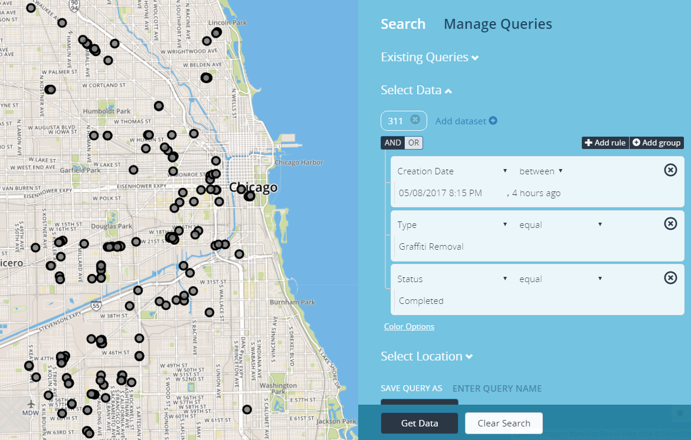

There are operators used in conjunction with dates and time being applied to a search.

- **between** - presents two value filter fields and returns data that’s between the two filter values specified.

- **greater** - returns all data that’s after than the date/time specified.

- **less** - returns all data that’s before than the date/time specified.

To add a date to a query, enter specific search parameters in Add data-set section in the find data panel. In the parameter drop-list select a date parameter from the drop-list of the specified data-set.

When the date parameter is applied, the operand “between” and two search fields will appear called <b>“ENTER FILTER VALUE”</b> as the default. Place the mouse into <b> “ENTER FILTER VALUE”</b> field, to add time and date, the calendar appears with current date as the default. The calendar has optional ways on how a user can enter and display date into the application when setting up a search. 

<table>
        <tr>
            <th>
                <b>Element No.</b>
            </th>
            <th>
                <b>Element Description</b>
            </th>
        </tr>
        <tr>
            <td>
                1.
            </td>
             <td>  
                Operators - determines how dates are entered.
            </td>
        </tr>
        <tr>
            <td>
                2.
            </td>
            <td>
                ENTER FILTER VALUE - where time is entered.
            </td>
        </tr>
        <tr>
            <td>
                3.
            </td>
            <td>
                Month/Year Identifier - Displays the Month/Year being presented for a search. When calendar is displayed, current month/year appear as default.
            </td>
        </tr>
        <tr>
            <td>
                4.
            </td>
            <td>
                less than carat - allows user to enter past dates. 
            </td>
        </tr>
        <tr>
            <td>
                5.
            </td>
            <td>
                Greater than carat - allows users to enter current or future dates.
            </td>
        </tr>
        <tr>
            <td>
                6.
            </td>
            <td>
                weekday - day of the week
            </td>
        </tr>
        <tr>
            <td>
                7.
            </td>
            <td>
                date of the month - specified day of the month
            </td>
        </tr>
        <tr>
            <td>
                8.
            </td>
            <td>
                Select Time - switches between the calendar and time panel allowing the user to enter time. Time is displayed as 12 hour.
           </td>
        </tr>
</table>
 

 
<table>
        <tr>
            <th>
                <b>Select Time Description</b>
            </th>
        </tr>
        <tr>
            <td>
                 Select Time: Switches back to the calendar panel
            </td>
        </tr>
        <tr>
            <td>
                 Increment Hour: Increases hour in time
            </td>
        </tr>
        <tr>
            <td>
                 Increment Minute: Increase minutes in time
            </td>
        </tr>
        <tr>
            <td>
                 Pick Hour: Active link it switches to the hour panel where an hour can be choose from numerically (0-12) 
            </td>
        </tr>
        <tr>
            <td>
                 Pick Minute: Active link it switches to the minute panel where minutes chosen in increments of 5s (00 thru 55)
            </td>
        </tr>
        <tr>
            <td>
                 Toggle Period: Meridiem Selector
            </td>
        </tr>
        <tr>
            <td>
                 Decrement Hour: Decrease hour in time
            </td>
        </tr>
        <tr>
            <td>
                 Decrement Minute: Decrease minutes in time
            </td>
        </tr>
</table>

 

## Using Relative Time in a Search

Here are some examples in using dates and times in combination of a search.
Some searches that occur displays results from current date/time if not specified.
Always default to current date/time when placing cursor in the value filter.

- yesterday
- tomorrow
- today
- day (i.e. a day ago, 2 days ago, etc.)
- week (i.e. a week ago, 2 weeks ago, etc.)
- month (i.e. a month ago, 2 months ago, etc.)
- year (i.e. a year ago, 2 years ago, etc.)
- seconds (i.e. 15 seconds ago, 30 seconds ago, etc.)
- minutes (i.e. 15 minutes ago, 30 minutes ago, etc.)
- hours (i.e. 1 hour ago, 2 hours ago, etc.)

### Relative Time
<h6>Using days</h6> 

- <b>Crimes</b>  
	- Incident Date <i>between</i><b> 9 days ago</b> and <b>7 days ago</b> (from the current date/time)

- <b>Crimes</b>
	- Incident Date <i>between</i><b> 7/22/2016 9:30:00 AM</b> and <b>a week ago</b>

- <b>Crimes</b>
	- Incident Date <i>between</i><b> a week ago</b> and <b>today</b>

<h6>Using hours</h6>

- <b>Crimes</b>
	- Incident Date <i>between</i><b> 3 hours ago</b> and <b>2 hours ago</b> (from the current date/time)

<h6>Using greater and less than in relative time</h6>

- <b>Crimes</b>
	- Incident Date <i>greater than</i><b> 4 days ago</b>

- <b>Crimes</b>
	- Incident Date <i>greater than</i><b> a week ago</b>

- <b>Crimes</b>
	- Incident Date <i>less than</i><b> 10 hours ago</b>

- <b>Crimes</b>
	- Incident Date <i>less than</i><b> 30 minutes ago</b>

- <b>Crimes</b>
	- Incident Date <i>less than</i><b> today</b>

### Absolute Time

- <b>Crimes</b>
	- Incident Date <i>between</i><b> 8/31/2016 9:30:00 AM</b> and <b>8/31/2016 10:30:00 AM</b>

<h6>Using Seconds</h6>

- <b>Crimes</b>
	- Incident Date <i>between</i><b> 8/31/2016 10:30:00 AM</b> and <b>8/31/2016 10:30:58 AM</b>

<h6>Using greater and less than in absolute time</h6>

- <b>Crimes</b>
	- Incident Date <i>greater than</i><b> 7/22/2017 11:30:00 PM</b>

- <b>Crimes</b>
	- Incident Date <i>less than</i><b> 7/22/2017 11:30:00 PM</b>

Users can apply time series to a search. The search will return all plotted data from the time series specified within the defined search.

<b>Relative Time Search</b>

