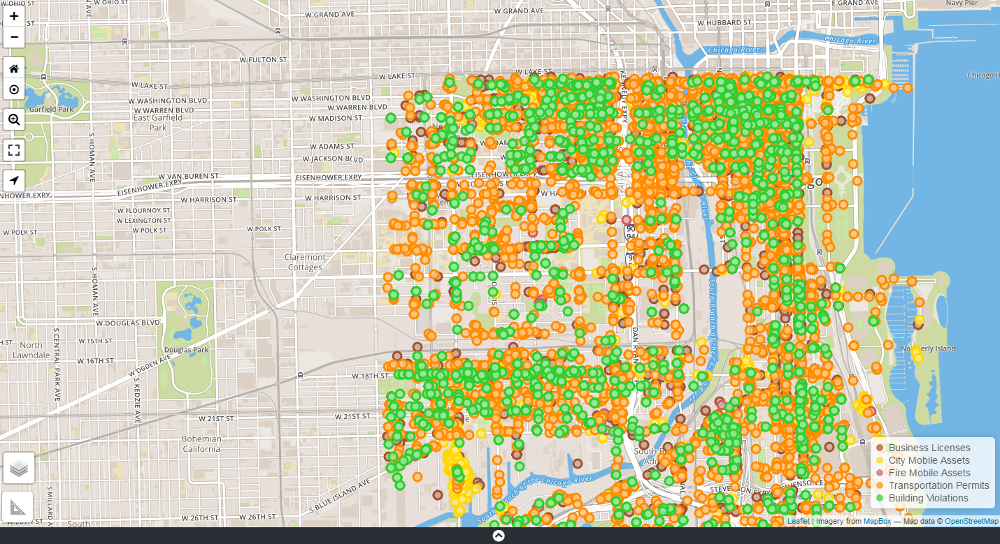

## Map Grid
The grid is interactive, a user can navigate the map using a mouse,
keyboard and for mobile devices by swiping using index finger or pin. 
The map displays the maximum of 1000 points. 

All data appears on the grid as points and/or markers. &nbsp; Place/Address search plots
as markers and Datasets plots as points on the grid. &nbsp; A retractable information box 
appears to the bottom right of the grid when a search is executed, displaying the no. of 
records found or an error message pertaining to a search, if any occurs.

The grid has an automatic refresh mechanism for replotting and repositioning data points
on the grid; when the grid is being moved or manipulated.

<!--

 
<b>Launch Screen</b>

n-->

## The Launch Screen

<table>
  <tr>
    <th><b> Element No.</b></th>
    <th><b>Element Name/Description</b></th>
  </tr>
        <tr>
    <td>
      1.
    </td>
    <td>
        Quick Search box is used to perform basic searches on datasets. The question mark icon within the Quick Search        box displays a cheat sheet for quick search syntax.
    </td>
  </tr>
  <tr>
    <td>
      2.
    </td>
    <td>
      <ul>
        <li>Find Data Button displays the advanced search panel utilize to create more defined searches.</li>
        <li>Clear Data Button, resets the map.</li>
      </ul>
    </td>
  </tr>
  <tr>
    <td>
      3.
    </td>
    <td>
      User Manual Link 
        <ul>
          <li>Link to accessing the OpenGrid user manual.</li>
      </ul>
    </td>
  </tr>
  <tr>
    <td>
      4.
    </td>
    <td>
      Zoom In and Zoom Out Icon 
    </td>
      </tr>
      <tr>
          <td>
                5.
          </td>
          <td>
                Reset Map View and Area Zoom Icon 
          </td>
      </tr>
    <tr>
          <td>
                6.
          </td> 
          <td>
                Zoom Specification Icon 
           
                Full-Screen Icon  
           
              Geo-Location Icon 
          </td>
    </tr>
     <tr>
          <td>
               7.
          </td>
        <td>
      Measurement Tool 
    </td>
     </tr>  
  <tr>
    <td>
      8.
    </td>
        <td>
                Layers Icon  
          
      Consist of list of grid views and weather layers.
         
            <b>Base Layers Views:</b>
                    <ul> <ul> <ul>
                            <li>Street View (Default)</li>
                            <li>Aerial View</li>
                            <li>Black and White View</li>
                    </ul></ul></ul>
            <b>Open Weather Layers:</b>
                    <ul> <ul> <ul>
                            <li>Cloud Cover</li>
                            <li>Quantity of Precipitation</li>
                            <li>Sea Level Pressure</li>
                            <li>Temperature</li>
                    </ul></ul></ul>
          </td>
      </tr>
      <tr>
        <td>
            9.
        </td>
        <td>
            Expandable Table View Panel
        </td>
    </tr>
    <tr>
        <td>
            10.
        </td>
        <td>
            Map attribution; display's a link for any copyright information, terms of usage, etc.
        </td>
    </tr>
    <tr>
        <td>
            11.
        </td>
        <td>
            Main Map Display
        </td>
    </tr>
</table>

 

## Map/Base Layers

The layers’ icon displays multiple basemap views and [open weather layers](../map-layers/index.md#open-weather-maps ). The list is built dynamically based on what's available through the map service provider. In the lower right hand corner on the grid, there is information and active links provided about the map services. The initial launch page displays the default basemap, street view **(see login launch screen image above)** and all other basemaps see images below.

<b>Aerial View</b>

<b>Grayscale View</b>

### Map Key/Legend

Map key provides essential information of understanding a map. OpenGrid uses colors to signify what type of search has been executed; the key explains what the color represents. The legend is located at the bottom right of the map. If, multiple parameter types with same dataset is being displayed for a search; it will display the two datatypes based off color representation from the setup on the grid.

<b>Map Grid and Key/Legend</b>

## Map Navigation

Navigation tools are used to aid users in finding their way around a
map. Using navigational controls, the user will be able to:

  -   zoom in/out

  -   reset the map

  -   pan to any direction

  -   switch to full screen mode

  -   activate geo-location

  -   apply layers

  -   apply measurements

  -   select hyperlinks