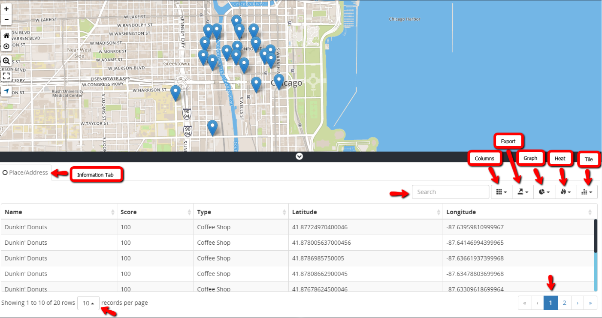
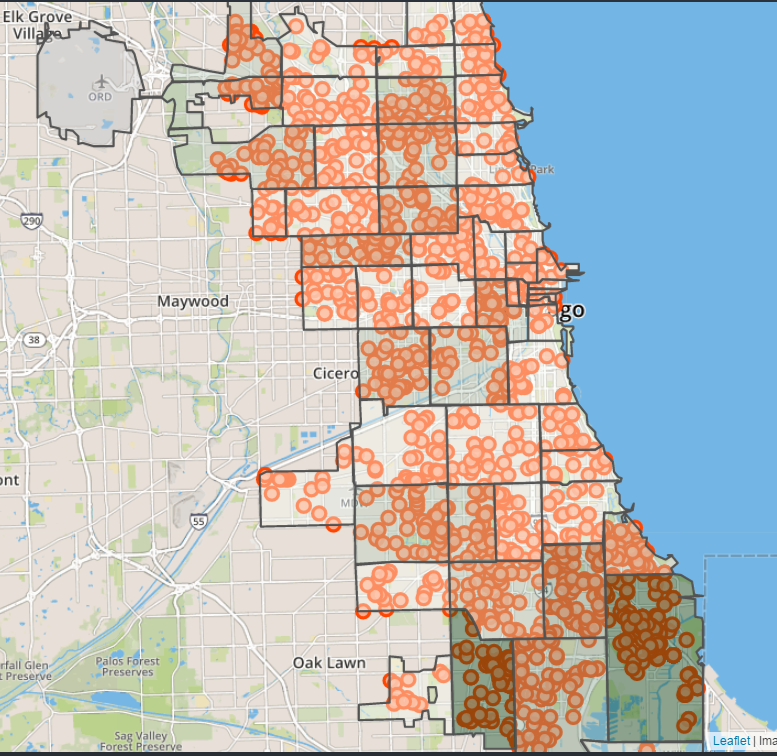

## Table Grid

The table grid is located at the bottom of the map. The table becomes active when a search has been performed and returns a set of results on the map. To access the table, click on the black bar at the bottom of the map, there is a white carat displayed in the middle of bar below as an indicator that the bar is collapsible. After clicking on the bar, the table will expand upward exposing the table and its components.

<b>Table Grid</b>

## Components of a Table Grid

### Information Tab

Search Type (i.e. Place/Address, Business License).

### Search Textbox

Used to filter by data components within the table.

### Columns Icon

Provides a drop list of available columns pertaining to the data within the datasets. The columns are interchangeable; user can enable and disable certain columns from the table by selecting or deselecting each column name from the column list.

### Export Icon

Provides a drop-list of available exportation options used to send
or transfer data from the table into the following formats:

CSV - Comma Separated Values

PDF - Portable Document Format

MS Excel - Microsoft Excel

### Heat Map

Data that’s contained in a matrix within a representation of colors to use for analysis, comparison or trending purposes. For full description see [Heat Maps](../charts-heatmaps/heatmaps).

### Tile Map

Small images, usually rectangular or isometric layers that acts as puzzle pieces to cover an intended area. For full description see [Tile Maps](../charts-heatmaps/tile-map).

### Rows Droplist

Provides a drop list of total number of rows that can be displayed per page.

### Page Numbers

Interactive number links for maneuvering through pages.
