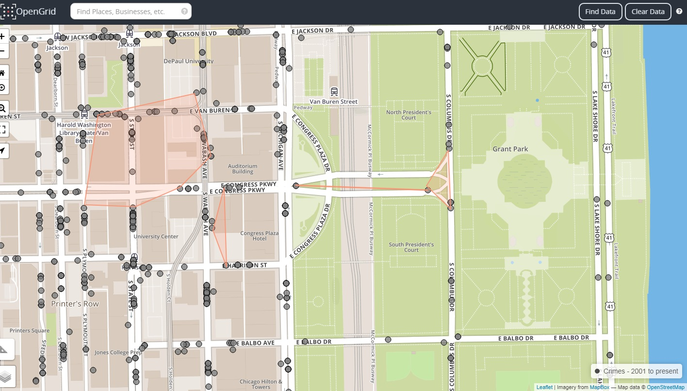
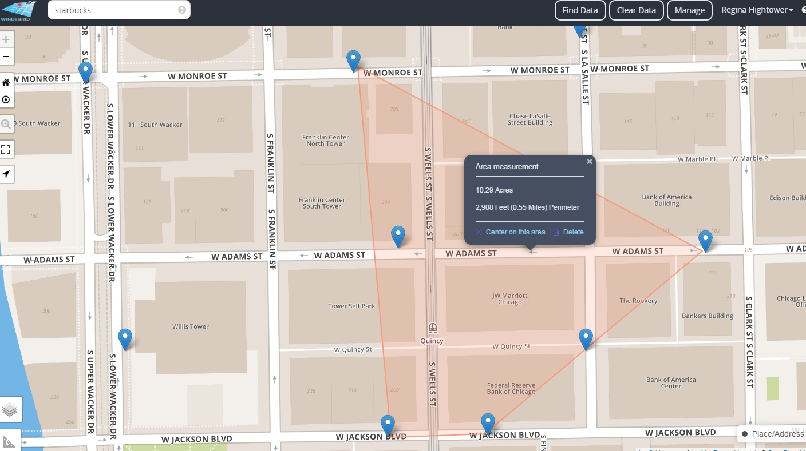

## Measurement Tool

Measurement tool is an interactive feature that allows a user to measure lines and areas on a map. You can use the tool to draw a linear or polygon shape on a map. Selecting the measurement icon will enable the measurement tool to perform the following:

##### Linear Measurement

-   Distance between points

##### Area Measurement

-   Distance around a point

<b>Linear Measurement</b>

 

<b>Multiple Linear Measurement</b>

 

<b>Area Measurement</b>

 
