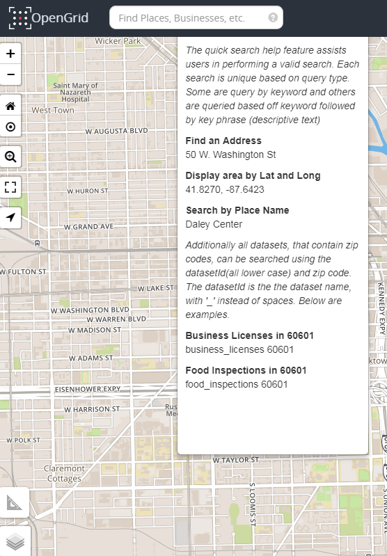
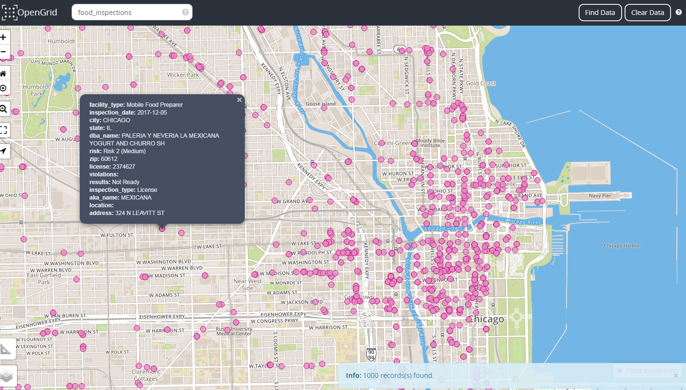
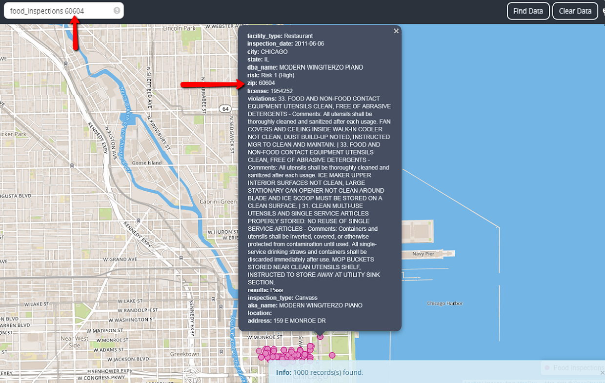
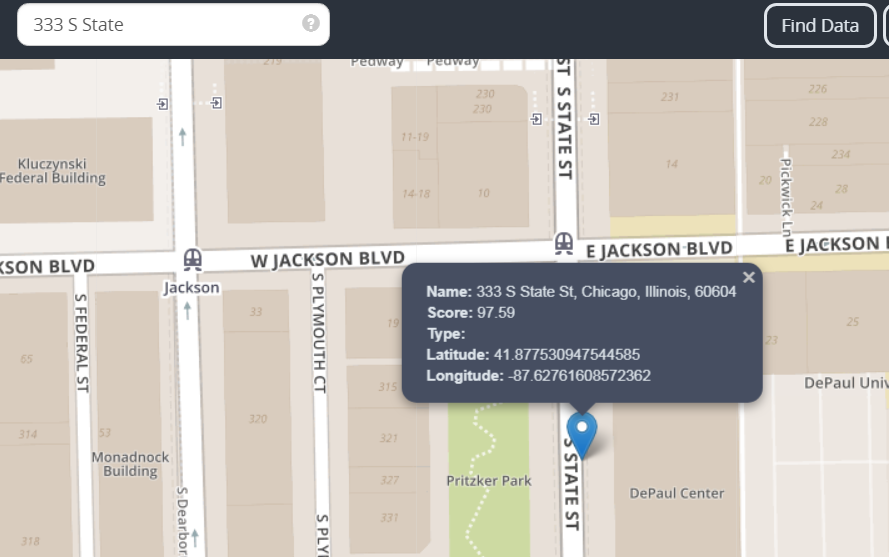
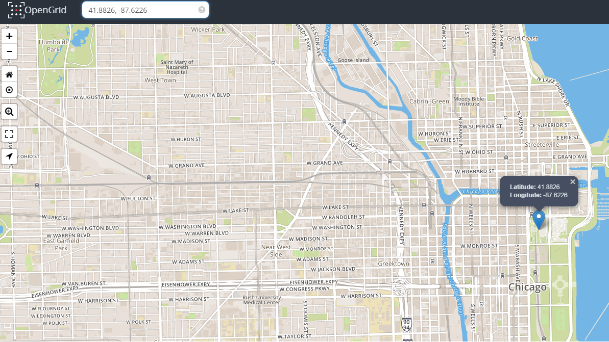
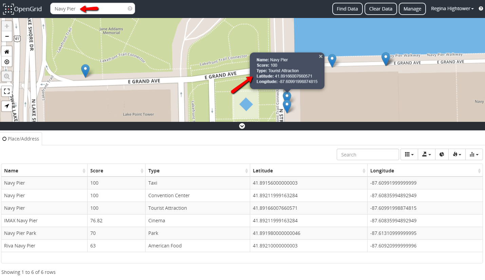
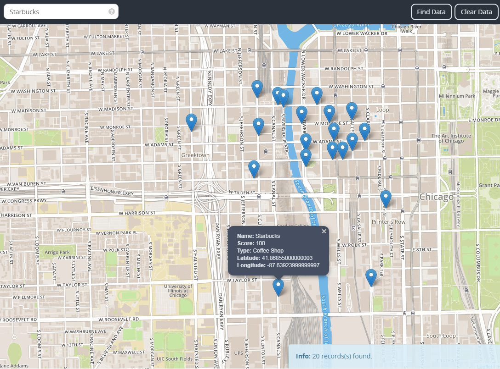

Quick Search is a feature used to provide basic point of interest and data-set searches. It is located in the upper left corner of the application. The searches are conducted with the following syntax: keyword only <b><i>&lt;keyword only&gt;</i></b>, or keyword followed by keyphrase <b><i>&lt;keyword&gt;&lt;keyphrase&gt;</i></b>. Quick Search supports the following commands/inputs:

<table class="tg">
<tr>
   <th class="tg-us36">Search Type</th>
   <th class="tg-us36">Description</th>
   <th class="tg-us36">Command Syntax</th>
   <th class="tg-us36">Sample</th>
</tr>
<tr>
<td class="tg-us36">Address</td>
   <td class="tg-us36" align="Top">Displays information about an address as a marker on the grid; the marker is centered within the address location.</td>
   <td class="tg-us36" align="Center" width="250">&lt;Num&gt;&lt;Dir&gt;&lt;St&gt;</td>
   <td class="tg-us36" width="150">50 W. Washington</td>
</tr>
<tr>
<td class="tg-us36">Dataset</td>
<td class="tg-us36" width="300">Displays information about a dataset as points on the grid. The points are layered based on the geographical position of the data. The maximum of 1000 points can plot on the map.</td>
<td class="tg-us36" width="300">&lt;keyword only&gt; &lt;keyword&gt;&lt;keyphrase&gt;  </td>
<td class="tg-us36"width="275">food_inspections food_inspections 60604</td>
</tr>
<tr>
  <td class="tg-us36">Latitude and Longitude</td>
  <td class="tg-us36" width="300">Displays lat/long coordinates as a marker on the grid.</td>
  <td class="tg-us36" width="250">&lt;latitude&gt;, &lt;longitude&gt;</td>
  <td class="tg-us36" width="200">41.8270, -87.6423</td>
</tr>
<tr>
 <td class="tg-us36">Place Name/Type</td>
 <td class="tg-us36" width="300">Plots marker/s on the grid within the coordinates of the Place Name/Type.</td>
 <td class="tg-us36">&lt;Place Name&gt;  &lt;Place Type&gt;</td>
 <td class="tg-us36" width="200">
 	Place Name:
 		<ul>
		<li>Daley Center</li>
        	<li>Wrigley Building</li>
 		</ul>
	Place Type:
		<ul>
		<li>Pharmacy</li>
		<li>Tourist Attraction</li>
		</ul>
 </td>
</tr>
</table>

## Performing a Quick Search
Quick Search identifies pattern matches and not exact matches within a search.

There are rules in performing a Quick Search such guidelines are displayed in the Help Icon. To access quick help, select the question mark icon in the Quick Search bar. Quick Help is like a cheat sheet for setting up dataset searches. When the icon is selected, the panel expands with a list of several types of search syntax, that aids in performing a quick search. 

### Dataset Search
When a search is executed the data plots as points on the grid pertaining to the type of criteria being displayed in the search bar. <b><i>&lt;keyword only&gt;</i></b> displays all unfiltered results from a dataset called food inspections. In the bottom right corner of the grid an information bar appears displaying the total number of results returned. Data points are limited to 1000 points on the grid. An example of a &lt;keyword only&gt; search is displayed below.

<b><i>&lt;keyword only&gt;&lt;keyphrase&gt;</i></b> displays a parameter base search. The example below searches food inspections in zipcode 60604.

### Address Search
The Address search returns a marker on the grid centered within the address location.

### Lat/Long Search
Lat/Long searches places a marker on a grid and centers within the area of the locale; within the marker it displays information about the search which is the lat and long coordinates.

### Place Name Search
Place Name/Type searches includes but not limited to businesses, buildings, and landmarks. It plots as marker/s on a grid, centered within its location. When there are multiple pins plotted, the grid centers itself to include all search results. Each marker provides information about the search such as name, the type of search (in this case the Type is a <b><i>Tourist Attraction</i></b>) and its coordinates. Users can also run a quick search by Place Type such example types are: Bank, School, Church, Park, Pharmacy, etc. 

Business search displays a collection of markers on the grid of a business specified. Each marker is placed within the locale of the establishment throughout the city, the maximum number of markers that can appear on grid is 20. The marker displays the name of the search, the score, the type of search and its coordinates. An example of a business search is displayed below.

