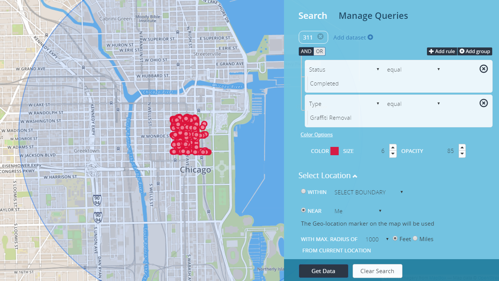
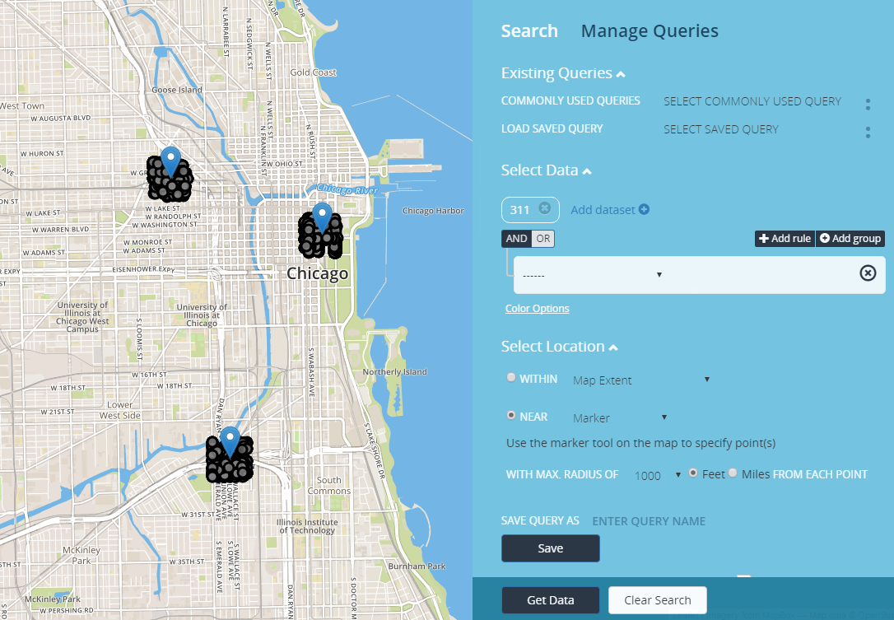

# Searching Near a Location
You can search around a particular location, such as an address or your current location. Set the radius around the point and find any data within that circle. To search around a particular location, click on "Select Location" within the "Find Data" panel.

## Search Around Me (current location)
  1. Select "Me" from the drop-down menu. Depending on your browser privacy preferences, it will ask if you will allow the browser to detect your current location.
  2. Allow the browser to send your location (this data is not stored). Your location will be estimated and the accuracy will depend on your internet service provider. A blue circle will appear which shows the estimated area of your current location.
  3. Select a radius to search within. The application will use the blue dot as the starting point for your location.
    - Radius in Feet – Min (100ft) and Max (1000ft) in 100 foot increments.
    - Radius in Miles – Min (1/8mi) and Max (1mi) in 1/8th mile increments.

<b>Geo-Location Filter</b>

## Search Around a Marker

  1. Select "Marker" from the drop-down menu; the marker icon will appear on the grid.
  2. Click on the marker icon and begin plotting markers on the map.
  3. Define the radius for the marker/s; if multiple markers are plotted on the map, the search will plot around each marker based off the radius defined.

<b>Near Marker</b>

