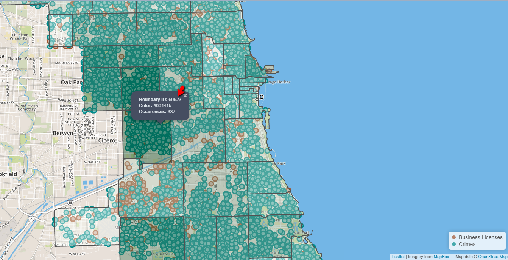

# How to Create a Tile Map

Tile maps (choropleth) will use shading, instead of individual points, to show the amount of data by different regions. Tile maps can be generated from the table grid window.

  1. Plot the data you want to display
  2. Click on the Table Grid bar
	  
  3. Click on the Tile Map icon and select which region you want to display data
	
	
<b>Tile Map by Zipcode </b>

# Removing/Hiding Tile Map

To remove the tile from the grid select the option "None" from the droplist. Alternatively, you can click on the "Layer" button and temporarily hide the tile map from the ["Generated Layers"](../map-layers/index.md#available-layers) section.
